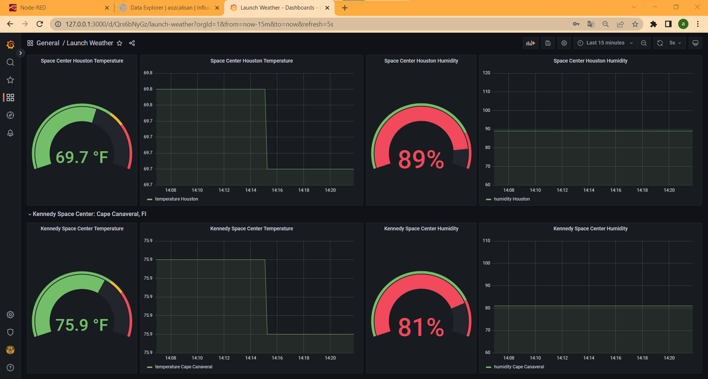
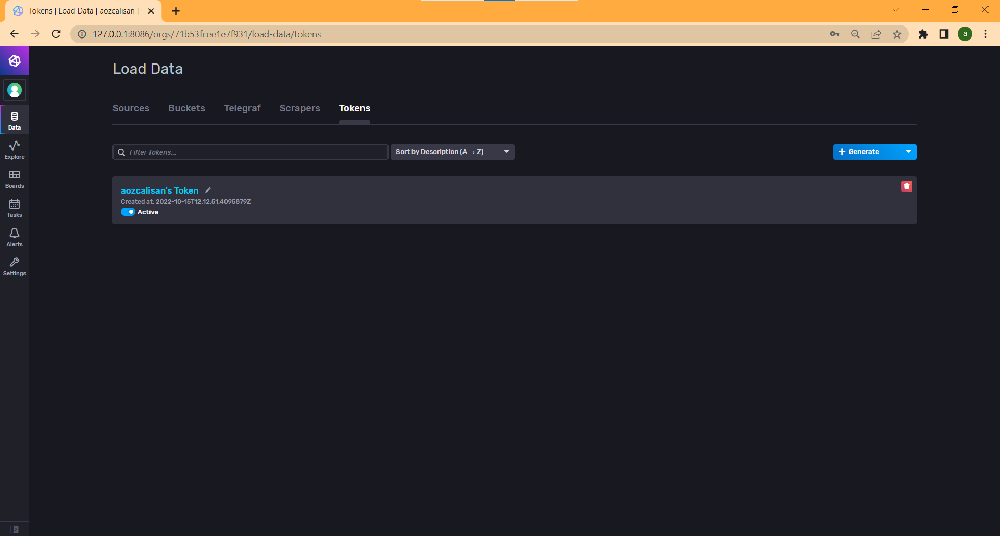
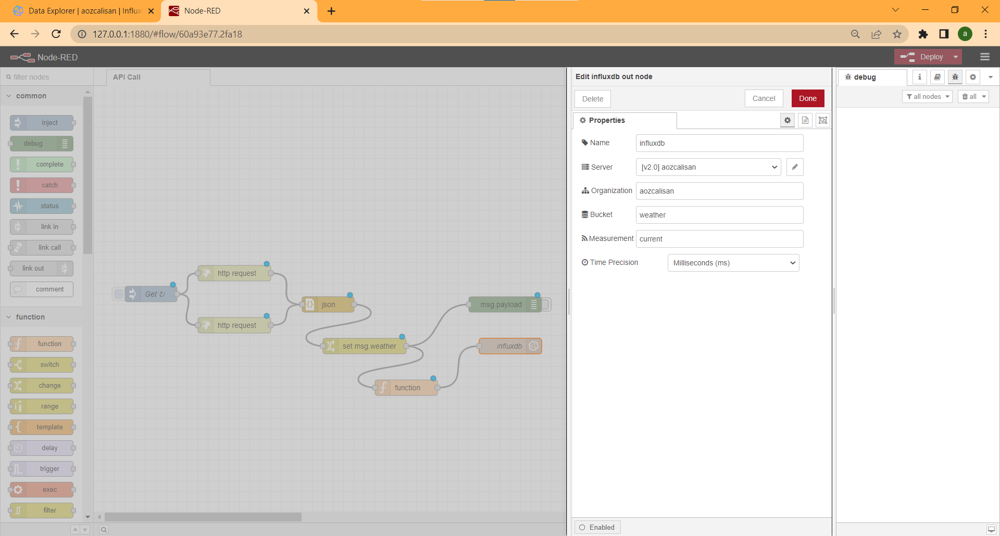
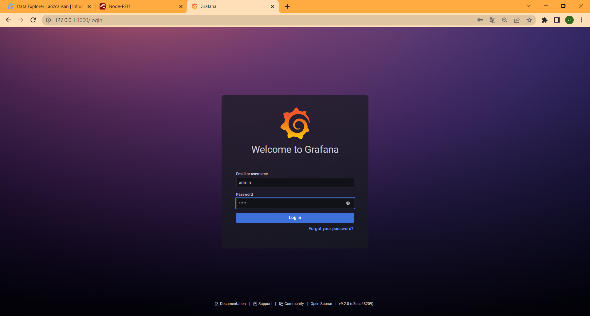

# Grafana-Influxdb-Nodered Stack  

## Terraform Docker Deployment

This deployment's goal is to create a live weather dashboard for Kennedy Space Center Houston with Terraform.

Some screenshots of deployment:

Kennedy Space Center Houston live weather.

Influxdb

Nodered flows with Influxdb Configurations 

Grafana 

